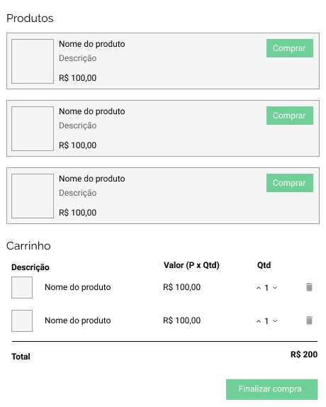

# Prova prática de Fullstack

Você deverá criar uma mini loja e-commerce + API REST que vai listar os produtos e mostrar produtos escolhidos pelo usuário.

Quando um cliente faz um pedido, a implementação deve comunicar com o fornecedor deste produto. A arquitetura desse projeto deve ser eficiente ao ponto de conseguir fazer a integração com um novo fornecedor mantendo o mesmo protocolo/interface (Lembrando que cada fornecedor possui suas próprias regras de negócio e API diferentes).

## (Front-end)

**Funcionalidades**

- O usuário deve ter a capacidade de remover/atualizar a quantidade de cada produto no carrinho. 
- O carrinho deve mostrar o preço total contabilizado

**Requrimentos**

- Deve utilizar gerenciadores de estado como Vuex/Redux

## (Back-end)

Requerimento:

Utilização de SOLID e Design Patterns
Banco de dados
Métodos:
order/create
order/getById
products/get

Desejavel:
Testes unitários

